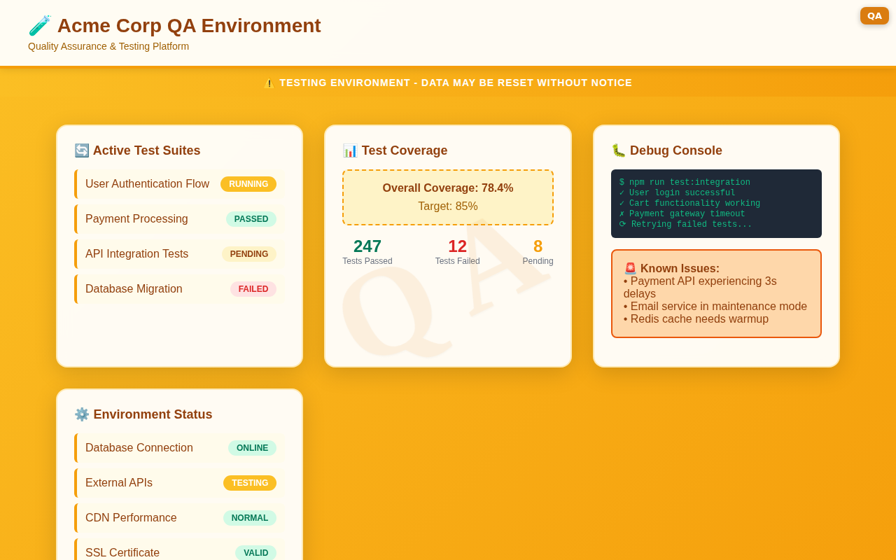

# Enviro-Shade

[](https://chrome.google.com/webstore/detail/enviro-shade/epdlbkjhnbhhaecjebhfnimenndpgalc)
[](https://addons.mozilla.org/en-US/firefox/addon/enviro-shade/)
[](https://github.com/nkoeppe/Enviro-Shade/releases)
[](LICENSE)
[](https://github.com/nkoeppe/Enviro-Shade/stargazers)

> **Never accidentally deploy to production again!** 🚀

Ever accidentally pushed to production because you lost track of which environment you were in? We've all been there. Enviro-Shade is your safety net, making it **visually impossible** to mistake your deployment environments.

A powerful browser extension that adds customizable color banners and watermarks to websites, helping developers instantly identify which environment they're working in: `PRODUCTION`, `STAGING`, `QA`, `LOCAL`, or any custom environment you define.

## 📸 Screenshots

### Production Environment Warning

*High-severity red "PRO" badge clearly identifies production environment*

### QA/Staging Environment

*Medium-severity orange "QA" badge for testing environments*

### Extension Options

*Easy-to-use configuration interface for managing environment rules*

## ✨ Features

- **🎨 Visual Environment Indicators**: Color-coded banners and watermarks that instantly show which environment you're in
- **⚡ Severity Levels**: Subtle indicators for `LOCAL`, prominent warnings for `PRODUCTION`
- **🏷️ Toolbar Badge**: Quick environment identification right in your browser toolbar  
- **🎯 Smart Pattern Matching**: Powerful glob patterns with support for complex URL structures
- **📝 Blocklist Support**: Exclude specific URLs from showing overlays, even if they match rules
- **🔧 Live Preview**: Test and preview your rules in real-time before saving
- **📱 Flexible Configuration**: Add rules manually or auto-generate from your current tabs
- **🌐 Cross-Browser**: Works seamlessly on Chrome, Firefox, and other Chromium-based browsers
- **🎭 Smart Defaults**: Pre-configured for common development environments and Cloud Foundry deployments

## 📦 Installation

### Official Stores (Recommended)

[](https://chrome.google.com/webstore/detail/enviro-shade/epdlbkjhnbhhaecjebhfnimenndpgalc)
[](https://addons.mozilla.org/en-US/firefox/addon/enviro-shade/)

- **Chrome Web Store**: One-click installation with automatic updates
- **Firefox Add-ons**: Fully reviewed and automatically updated

### Quick Start
1. **Install** from your browser's extension store  
2. **Click** the Enviro-Shade icon in your toolbar
3. **Configure** your environment patterns
4. **Navigate** to your websites and see the magic! ✨

### Manual Installation (for development)

1. Download the extension:
   - Clone this repository: `git clone https://github.com/nkoeppe/Enviro-Shade.git`
   - Or download the latest release as a ZIP file from the [releases page](https://github.com/nkoeppe/Enviro-Shade/releases) and **extract/unpack it** to a folder
2. **For Chrome:**
    - Open Chrome and navigate to `chrome://extensions`.
    - Enable "Developer mode".
    - Click "Load unpacked" and select the `src/` folder containing the extension files.
    
    **Chrome Auto-Load Workaround (Windows):**
    To automatically load the extension every time Chrome starts:
    - Navigate to `C:\ProgramData\Microsoft\Windows\Start Menu\Programs`
    - Find the Google Chrome shortcut, right-click → Properties
    - In the Shortcut tab, find the "Target" field
    - Append `--load-extension="PATH_TO_EXTENSION"` to the end
    - Example: `"C:\Program Files\Google\Chrome\Application\chrome.exe" --load-extension="C:\Users\YourName\Downloads\EnviroShade"`
    - Replace the path with your actual extension folder path
    
3. **For Firefox:**
    - Open Firefox and navigate to `about:debugging`.
    - Click "This Firefox" and then "Load Temporary Add-on...".
    - Select the `manifest.json` file from the `src/` folder.

## 📖 Documentation

### For Users
- **📋 [Installation Guide](docs/user/installation.md)**: Complete setup instructions for all browsers
- **⚙️ [Configuration Guide](docs/user/configuration.md)**: Learn to create rules, patterns, and customize your setup

### For Developers  
- **🚀 [Developer Quickstart](docs/developer/quickstart.md)**: Get coding in minutes
- **🤖 [Automation Setup](docs/developer/automation-setup.md)**: GitHub Actions for releases and store publishing
- **🤝 [Contributing Guide](docs/CONTRIBUTING.md)**: Help make Enviro-Shade better

## 🎯 Use Cases

### Production Safety
```
Pattern: *production*, *prod*
Color:   🔴 Red  
Severity: High (impossible to miss!)
Result:  ⚠️ PRODUCTION banner with strong overlay
```

### Staging Environment
```  
Pattern: *staging*, *qa*
Color:   🟡 Yellow
Severity: Medium (visible reminder)
Result:  QA banner with moderate overlay
```

### Local Development
```
Pattern: localhost*, 192.168.*
Color:   🟢 Green
Severity: Low (subtle indicator)
Result:  LOCAL banner with minimal overlay
```

## 🔧 Quick Configuration

After installation, click the extension icon and set up your first environment:

1. **Pattern**: `*://app.yourcompany.com/*` (production URL)
2. **Label**: `PRODUCTION`  
3. **Color**: Red `#dc2626`
4. **Severity**: `High`

Now production sites will show a prominent red warning! 

## 🔒 Privacy & Security

- **🏠 Local-only**: Runs entirely on your machine
- **📡 No tracking**: Zero data collection or external requests
- **🔐 Secure storage**: Uses browser's encrypted sync storage
- **👁️ Open source**: Full code transparency and community review

## 🛠️ Development

Simple setup - no build tools required!

```bash
git clone https://github.com/nkoeppe/Enviro-Shade.git
cd Enviro-Shade
# Load directly in browser - it's plain JavaScript!
```

**Architecture:**
- `src/manifest.json` - Extension configuration
- `src/background.js` - Rule matching and badge logic  
- `src/content.js` - Overlay injection and display
- `src/options.js/html/css` - Configuration interface

### Demo Applications & Screenshots

Generate professional screenshots and test the extension:

```bash
# Install dependencies
npm install

# Start demo applications
npm run demo:start

# Generate Chrome Web Store ready screenshots
npm run screenshots:chrome

# Generate Firefox screenshots  
npm run screenshots:firefox

# Stop demo applications
npm run demo:stop
```

This starts two realistic demo applications:
- **Production Dashboard**: http://localhost:3000 (professional blue theme)
- **QA Testing Environment**: http://localhost:3001 (testing orange theme)

Perfect for demonstrating overlay functionality with different environments. Screenshots are automatically generated in `docs/assets/screenshots/` and are ready for Chrome Web Store submission (1280x800px).
